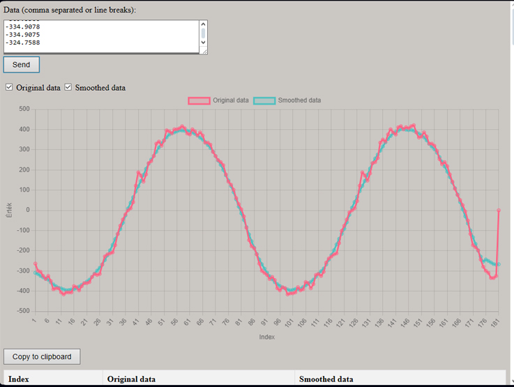

# [Line Chart with Moving Average](https://lebryere.github.io/moving-average-chart/)

## Browser Support

 |  |  |  |  | 
--- | --- | --- | --- | --- | --- |
99+ ✔ | 96+ ✔ | 93+ ✔ | 92+ ✔ | 87+ ✔ | 85+ ✔ |

## Preview

[](https://lebryere.github.io/moving-average-chart/)

**[View Live Preview](https://lebryere.github.io/moving-average-chart/)**

## Status

[](https://raw.githubusercontent.com/LeBryere/moving-average-chart/master/LICENCE)

# Line Chart with Moving Average

This project is a simple web application that displays a line chart with original and smoothed data. After pasting the data, users can choose how the original and smoothed data should be displayed: as a comma-separated list or newline-separated. The chart and table are automatically updated with the selected data.

## Features

- **Data Input:** Input data in either comma-separated or newline-separated format.
- **Moving Average Calculation:** Computes the moving average from the input data and displays it on the chart and in the table.
- **Chart Display:** Line chart of the original and smoothed data using Chart.js.
- **Table Display:** Table of the original and smoothed data.
- **Smoothed Data Display:** Optionally display smoothed data in comma-separated or newline-separated format.
- **Copy to Clipboard:** Ability to copy smoothed data to the clipboard.

## Usage

1. **Input Data:**
   - Use the "Data" text area to input data. You can paste the data in either comma-separated format or newline-separated format.
   - Click the "Submit" button to process the data.

2. **Data Display:**
   - Use the "Original Data" and "Smoothed Data" checkboxes to choose which data should be displayed on the chart.
   - Use the "Comma-Separated" and "Newline-Separated" checkboxes to select the format for displaying smoothed data.

3. **Copy to Clipboard:**
   - Click the "Copy to Clipboard" button to copy the smoothed data to the clipboard.

## Code Explanation

### HTML Structure
- The `dataForm` form contains a text area for data input and a button to submit the data.
- Two checkboxes allow you to choose how the data should be displayed on the chart.
- The `canvas` element is used for rendering the chart, and the `table` is used for displaying data in tabular form.

### JavaScript Functionality
- `addEventListener` is used to handle form submission and changes to the checkboxes.
- The `calculateMovingAverage` function computes the moving average based on the input data.
- The `updateTable` function updates the table with the new data.
- The `updateSmoothedDataText` function formats the smoothed data according to the currently selected checkbox state.
- The `updateChart` function updates the Chart.js chart with the data.

### CSS Styles
- The CSS code provides basic styles for the table and chart.

## Installation and Running

1. Clone the project from GitHub:

    ```bash
    git clone <repository-url>
    ```

2. Open the `index.html` file in your web browser.

3. Optionally, use a local development server if needed.

## License

This project is open source and free to use. Please respect the license terms of any libraries used.


## Copyright and License

Copyright 2024 Lebryere. Code released under the [](https://raw.githubusercontent.com/LeBryere/moving-average-chart/master/LICENCE)
