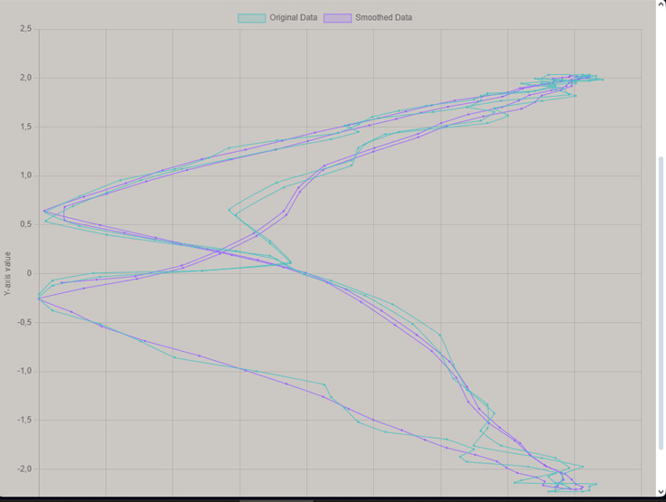
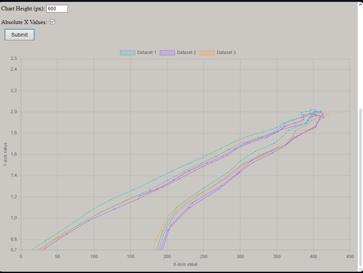

# [Line Chart with Moving Average](https://lebryere.github.io/moving-average-chart/)

## Browser Support

 |  |  |  |  | 
--- | --- | --- | --- | --- | --- |
99+ ✔ | 96+ ✔ | 93+ ✔ | 92+ ✔ | 87+ ✔ | 85+ ✔ |

## Preview

[](https://lebryere.github.io/moving-average-chart/)

**[View Live Preview](https://lebryere.github.io/moving-average-chart/)**

## Status

[](https://raw.githubusercontent.com/LeBryere/moving-average-chart/master/LICENCE)

# Line Chart with Moving Average

This project is a simple web application that displays a line chart with original and smoothed data. After pasting the data, users can choose how the original and smoothed data should be displayed: as a comma-separated list or newline-separated. The chart and table are automatically updated with the selected data.

## Features

- **Data Input:** Input data in either comma-separated or newline-separated format.
- **Moving Average Calculation:** Computes the moving average from the input data and displays it on the chart and in the table.
- **Chart Display:** Line chart of the original and smoothed data using Chart.js.
- **Table Display:** Table of the original and smoothed data.
- **Smoothed Data Display:** Optionally display smoothed data in comma-separated or newline-separated format.
- **Copy to Clipboard:** Ability to copy smoothed data to the clipboard.

## Usage

1. **Input Data:**
   - Use the "Data" text area to input data. You can paste the data in either comma-separated format or newline-separated format.
   - Click the "Submit" button to process the data.

2. **Data Display:**
   - Use the "Original Data" and "Smoothed Data" checkboxes to choose which data should be displayed on the chart.
   - Use the "Comma-Separated" and "Newline-Separated" checkboxes to select the format for displaying smoothed data.

3. **Copy to Clipboard:**
   - Click the "Copy to Clipboard" button to copy the smoothed data to the clipboard.

## Code Explanation

### HTML Structure
- The `dataForm` form contains a text area for data input and a button to submit the data.
- Two checkboxes allow you to choose how the data should be displayed on the chart.
- The `canvas` element is used for rendering the chart, and the `table` is used for displaying data in tabular form.

### JavaScript Functionality
- `addEventListener` is used to handle form submission and changes to the checkboxes.
- The `calculateMovingAverage` function computes the moving average based on the input data.
- The `updateTable` function updates the table with the new data.
- The `updateSmoothedDataText` function formats the smoothed data according to the currently selected checkbox state.
- The `updateChart` function updates the Chart.js chart with the data.

### CSS Styles
- The CSS code provides basic styles for the table and chart.

## Installation and Running

1. Clone the project from GitHub:

    ```bash
    git clone <repository-url>
    ```

2. Open the `index.html` file in your web browser.

3. Optionally, use a local development server if needed.

## License

This project is open source and free to use. Please respect the license terms of any libraries used.

[](https://lebryere.github.io/moving-average-chart/)

**[View Live Preview](https://lebryere.github.io/moving-average-chart/)**


# Line Chart with x - y Moving Average

This project is a simple web application that displays a line chart with original and smoothed data. Users can input data and choose how it should be displayed: as a comma-separated list or newline-separated. The chart is automatically updated with the selected data.

## Features

- **Data Input:** Input data in a tab-separated format.
- **Moving Average Calculation:** Computes the moving average from the input data and displays it on the chart.
- **Chart Display:** Line chart of the original and smoothed data using Chart.js.
- **X-Axis Absolute Values:** Optionally display the X-axis values as absolute values.
- **Dynamic Configuration:** Adjust chart height and Y-axis range through the form.

## Usage

1. **Input Data:**
   - Use the "Data (tab separated)" text area to input data. Paste your data in a tab-separated format.
   - Click the "Submit" button to process the data.

2. **Configure Moving Average:**
   - Set the "Moving average" input to determine the window size for the moving average calculation.

3. **Adjust Chart Settings:**
   - Set the "Y-axis max value" and "Y-axis min value" to adjust the Y-axis range of the chart.
   - Set the "Chart Height (px)" to adjust the height of the chart.

4. **Display Absolute X Values:**
   - Check the "Absolute X Values" checkbox to display the X-axis values as absolute values.

5. **Submit:**
   - Click the "Submit" button to update the chart based on the input data and settings.

## Code Explanation

### HTML Structure

- The `dataForm` form contains a text area for data input and several input fields to configure the chart.
- A checkbox allows you to choose whether to display X-axis values as absolute values.
- The `canvas` element is used for rendering the chart.

### JavaScript Functionality

- **Form Handling:** `addEventListener` is used to handle form submission and configuration changes.
- **Moving Average Calculation:** The `calculateMovingAverage` function computes the moving average based on the input data.
- **Chart Update:** The `updateChart` function updates the Chart.js chart with the data and settings.

### CSS Styles

- Basic CSS styles are provided for the table and chart container, ensuring a clean and responsive layout.

## Installation and Running

1. Clone the project from GitHub:

    ```bash
    git clone <repository-url>
    ```

2. Open the `index.html` file in your web browser.

3. Optionally, use a local development server if needed.

## License

This project is open source and free to use. Please respect the license terms of any libraries used.


## Copyright and License

Copyright 2024 Lebryere. Code released under the [](https://raw.githubusercontent.com/LeBryere/moving-average-chart/master/LICENCE)


[](https://lebryere.github.io/moving-average-chart/)

**[View Live Preview](https://lebryere.github.io/moving-average-chart/)**


# Line Chart with multi x - y Moving Average

This project is a web application that displays a line chart with multiple datasets, each with its own moving average. Users can input data for up to three datasets and configure various chart options.

## Features

- **Multiple Data Inputs:** Support for three separate datasets.
- **Moving Average Calculation:** Computes the moving average for each dataset based on user-defined window size.
- **Chart Display:** Displays a line chart with the original and smoothed data using Chart.js.
- **Dynamic Configuration:** Adjust chart height and Y-axis range through the form.
- **Absolute X Values:** Optionally display X-axis values as absolute values.

## Usage

1. **Input Data:**
   - Use the "Data 1", "Data 2", and "Data 3" text areas to input data. Each dataset should be pasted in a tab-separated format.
   - Click the "Submit" button to process the data.

2. **Configure Moving Average:**
   - Set the "Moving average" input to determine the window size for the moving average calculation.

3. **Adjust Chart Settings:**
   - Set the "Y-axis max value" and "Y-axis min value" to adjust the Y-axis range of the chart.
   - Set the "Chart Height (px)" to adjust the height of the chart.

4. **Display Absolute X Values:**
   - Check the "Absolute X Values" checkbox to display the X-axis values as absolute values.

5. **Submit:**
   - Click the "Submit" button to update the chart based on the input data and settings.

## Code Explanation

### HTML Structure

- The `dataForm` form contains text areas for three datasets and various input fields to configure the chart.
- A checkbox allows you to choose whether to display X-axis values as absolute values.
- The `canvas` element is used for rendering the chart.

### JavaScript Functionality

- **Form Handling:** `addEventListener` is used to handle form submission and configuration changes.
- **Moving Average Calculation:** The `calculateMovingAverage` function computes the moving average based on the input data.
- **Chart Update:** The `updateChart` function updates the Chart.js chart with the data and settings.

### CSS Styles

- Basic CSS styles are provided for the layout, including table and chart container styles.

## Installation and Running

1. Clone the project from GitHub:

    ```bash
    git clone <repository-url>
    ```

2. Open the `index.html` file in your web browser.

3. Optionally, use a local development server if needed.

## License

This project is open source and free to use. Please respect the license terms of any libraries used.

## Status

[](https://raw.githubusercontent.com/LeBryere/moving-average-chart/master/LICENCE)
